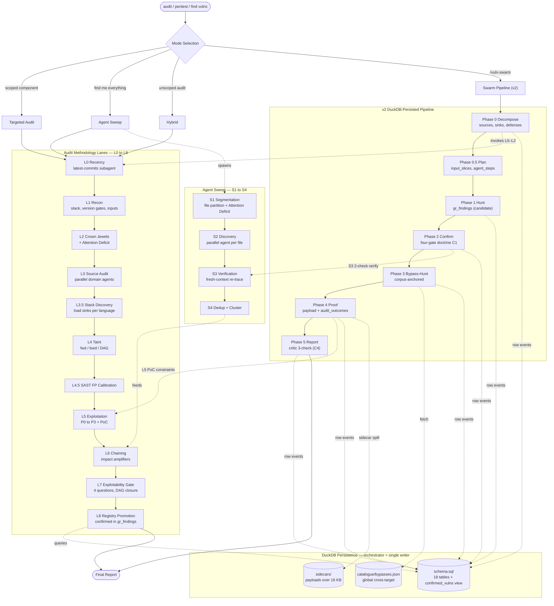

# vuln-research

Comprehensive vulnerability research skill for Claude Code. Covers source audit across 30+ attack domains, sink analysis for 12 programming languages, SAST/DAST integration, vulnerability chaining, and proof-of-concept development.

Built from real CTF challenges, bug bounty writeups, PayloadsAllTheThings, HackTricks, Web-CTF-Cheatsheet, PortSwigger Research, 50+ community cheatsheets/repositories, Thomas Ptacek's [Vulnerability Research Is Cooked](https://sockpuppet.org/blog/2026/03/30/vulnerability-research-is-cooked/) (Agent Sweep mode, Carlini methodology), Munch hybrid fuzzing/symbolic execution (arXiv:1711.09362), stateful-fuzzing taxonomy (arXiv:2301.02490), VulnLLM-R agent scaffolding/context retrieval (arXiv:2512.07533), and FuzzGPT history-driven LLM fuzzing (Deng et al., [arXiv:2304.02014](https://arxiv.org/abs/2304.02014)).

## What It Does

- **Two-layer pipeline**: v2 DuckDB-persisted phases (Decompose → Plan → Hunt → Confirm → Bypass-Hunt → Proof → Report) on top of an audit-methodology track (Phases L0–L8: Recency → Recon → Crown Jewel → Source Audit → Stack Discovery → Taint → SAST FP-calibration → Exploitation → Chaining → Exploitability Gate → Registry Promotion)
- **30+ attack domains**: SQLi, NoSQL, SSTI, XSLT injection, XSS, prototype pollution, DOM clobbering, CSS exfiltration, RCE, SSRF, XXE, deserialization (Java/PHP/.NET/Python/Ruby/Node), HTTP smuggling, browser-powered desync, cache poisoning, OAuth/JWT attacks, race conditions, and more
- **12-language sink catalog**: PHP, Python, Node.js, Java, Ruby, .NET, Go, Rust, C/C++, Kotlin/Android, Elixir/Erlang, Swift/iOS — with per-language files for token-efficient loading
- **SAST/DAST integration**: Semgrep rule IDs, CodeQL query packs, SonarQube RSPEC references, DAST detection signatures
- **Hybrid dynamic testing**: Munch-style FS/SF fuzzing↔directed symbolic execution, function/call-depth coverage, stateful message/trace fuzzing, protocol-state coverage
- **History-driven LLM fuzzing** (`fuzzgpt_history_lane`, FuzzGPT — Deng et al., arXiv:2304.02014): mine a target's own bug history into unusual edge-case seed programs (few-shot CoT / zero-shot / retrieval generation) that feed the boundary fuzzer, plus a target-agnostic differential oracle (impl/version/opt-level/config/reference) whose divergences are quarantined out of the security rankings until triage shows a security path
- **LLM agent scaffolding**: optional CodeQL/CPG/LSP function-context retrieval, target-vs-context function separation, context-sufficiency gates, CWE-policy narrowing, summary-based reasoning
- **Vulnerability chaining**: 10+ chain pattern categories with impact amplifiers and composite risk scoring
- **On-demand audit framework**: OWASP/STRIDE/PASTA methodology, red team personas, PoC templates, CVSS scoring, structured report generation

## Flow

The skill is two layers stacked on a shared DuckDB store. The **audit methodology lanes (L0–L8)** are what a researcher walks through; the **v2 pipeline (Phase 0–5)** is how the orchestrator + swarm move rows under single-writer discipline. Agent Sweep (S1–S4) is a parallel discovery lane that feeds back into the L lanes.



Phase L0 runs first in every mode whenever git history exists. The L lane is sequential by default but skips/reorders/loops freely as the target demands. The v2 pipeline phases are strictly sequential — each phase flushes to DuckDB in one transaction before the next begins; idempotency comes from UNIQUE constraints on natural keys plus stable hashes on every payload row.

## Structure

```
vuln-research/
├── SKILL.md                                    # Orchestrator — routing + methodology (always loaded)
├── README.md                                   # This file
├── commands/
│   └── vuln-swarm.md                           # Swarm Pipeline slash command (orchestration)
├── db/                                         # v2 DuckDB persistence layer
│   ├── schema.sql                              # 18 tables + confirmed_vulns view
│   ├── migrations/                             # Forward-only schema migrations
│   ├── sidecars/                               # Oversize (>16 KB) payload BLOBs
│   └── catalogue/                              # Global bypass catalogue (cross-target)
│       ├── bypasses.json                       # Sanitizer / blacklist / allowlist / generic families
│       ├── schema.sql
│       └── load.sql
└── references/
    ├── domain-reference-map.md                 # ~33-row routing table for every reference file below
    ├── recon-checklist.md                      # Phase L1 stack-fingerprinting + version gates + input vectors
    ├── phase-L0-recency.md                     # Phase L0 recency-pass subagent prompt
    ├── sast-triage.md                          # Phase L4.5 SAST FP-rate priors + calibration workflow
    ├── defense-layer-iteration.md              # Phase L7 — defense-as-attack-surface recursion
    ├── injection-attacks.md                    # SQLi, NoSQL, SSTI, XSLT injection, CRLF, LDAP, XPath
    ├── client-side-attacks.md                  # XSS, Prototype Pollution, DOM Clobbering, CSS Exfiltration, CORS, CSTI, postMessage
    ├── browser-attacks.md                      # XS-Leaks, Clickjacking, CSP Bypass, Browser Desync, HTML Smuggling
    ├── server-side-attacks.md                  # RCE, SSRF, XXE, File Ops, Deserialization (expanded)
    ├── auth-access-logic.md                    # Auth, Access Control, OAuth/SSO, JWT, Logic, Race, Crypto
    ├── protocol-infra-attacks.md               # Smuggling, Cache Poisoning, GraphQL, WebSocket, DNS, Cloud, Encoding, ReDoS
    ├── cicd-supply-chain.md                    # CI/CD pipelines, GitHub Actions, supply chain, runner security
    ├── automation-platform-attacks.md          # n8n, Zapier, Make.com, Power Automate, iPaaS workflows
    ├── infra-misconfig-attacks.md              # Traefik / Nginx / HAProxy bypass, Terraform state, docker socket, container escape
    ├── observability-telemetry-attacks.md      # OpenTelemetry, Prometheus, Grafana, log pipelines
    ├── sinks-catalog.md                        # Language router + SAST/DAST integration layer
    ├── binary-code-analysis.md                 # Thin index → binary-{triage-and-re, bug-classes, exploit-and-specialties}.md
    ├── binary-stack-triggers.md                # Phase L3.5 trigger map onto binary lifecycle files
    ├── chaining-advanced-techniques.md         # Chain patterns, scanning augmentation, blind spots checklist
    ├── dag-reasoning.md                        # DAGVul: source/intermediate/sink nodes, 12 failure-pattern taxonomy
    ├── agent-sweep.md                          # Agent Sweep methodology: Carlini discovery/verification loops
    ├── swarm-pipeline.md                       # Swarm Pipeline methodology: module decomposition, 3-stage pass, analog cascade
    ├── bypass-catalogue.md                     # 3-stage fetch protocol over db/catalogue/bypasses.json
    ├── critic-rubric.md                        # v2 Phase 5 REPORT critic rubric — 17 worked examples
    ├── confirmation-rigor-doctrine.md          # C1: four-gate promotion candidate → confirmed
    ├── forward-slicing-lanes.md                # C2: slice tuple, lane lifecycle, cascade semantics
    ├── autoloading-knowledge-layer.md          # C3: seed/expand, tri-signal acceptance, decay sweep
    ├── report-phase.md                         # C4: REPORT critic — comprehension/eligibility/attack-scenario
    ├── weakness-registry.md                    # Legacy pre-v2 JSONL registry spec (DEPRECATED — gr_findings IS the registry under v2)
    ├── audit-poc-report.md                     # On-demand: formal audit, PoC methodology, eligibility criteria, multi-finding report
    ├── bug-bounty-triage.md                    # On-demand: bug-bounty pre-submission triage funnel + single-finding submission template + worked example
    └── sinks/                                  # Per-language sink catalogs (loaded on demand)
        ├── php.md                              # PHP — exec, callbacks, type juggling, phar deser, magic hashes
        ├── python.md                           # Python — exec, pickle, SSTI, subprocess
        ├── javascript.md                       # Node.js — child_process, prototype pollution, NoSQL, ReDoS
        ├── java.md                             # Java — Runtime, JNDI, ysoserial, format-specific deser
        ├── scala.md                            # Scala — ToolBox.eval, LazyList/TrieMap deser, Akka, Play, Slick/Doobie/Quill
        ├── ruby.md                             # Ruby — system/eval, Marshal, ActiveRecord
        ├── dotnet.md                           # .NET — Process.Start, BinaryFormatter, Json.NET
        ├── systems.md                          # Go, Rust, C/C++, Elixir/Erlang
        └── mobile.md                           # Kotlin/Android, Swift/iOS
```

## Token Efficiency

The skill uses **two-tier progressive disclosure**:

1. **SKILL.md** (~460 lines) loads automatically — provides the v2 pipeline overview, mode-selection table, audit-methodology lane summaries, and pointers into the reference layer
2. **Domain reference files** load on-demand based on the active testing domain (injection, client-side, server-side, etc.) — routing table in `references/domain-reference-map.md`
3. **Per-language sink files** load on-demand based on the target codebase language — auditing a PHP app loads only `sinks/php.md` instead of the full 12-language catalog

This saves significant context window space compared to loading everything upfront. When auditing a PHP web app, you load SKILL.md + `injection-attacks.md` + `sinks/php.md` instead of a monolithic 2000+ line document.

## Installation

### Via Plugin Marketplace

```bash
# Add the skillsmd plugin source
/plugin marketplace add Lu1sDV/skillsmd

# Install the skill
/plugin install vuln-research@Lu1sDV/skillsmd
```

### Via npx

```bash
npx skills add Lu1sDV/skillsmd vuln-research
```

### Manual

```bash
git clone --depth 1 https://github.com/Lu1sDV/skillsmd.git
cp -r skillsmd/vuln-research ~/.claude/skills/
```

### Verify

```
What skills are available?
```

## Usage

The skill activates on keywords like "vuln assessment", "pentest", "bug bounty", "security audit", "find vulns", "exploit", "ctf", "code audit", "SAST", "DAST", "taint analysis".

### Standard Research

SKILL.md loads automatically, reference files load as needed based on the attack domain being tested:

```
Audit this codebase for vulnerabilities
```

```
Find injection vectors in the user registration flow
```

```
Perform taint analysis on this PHP application
```

### Formal Audit / PoC / Report

Ask explicitly to load the audit framework — e.g.:

```
Generate a vulnerability report for this application
```

```
Develop a PoC for the SSRF finding
```

```
Run a formal security audit using OWASP methodology
```

This loads `audit-poc-report.md` with OWASP/STRIDE/PASTA frameworks, red team personas, PoC script templates, proof collection requirements, and structured report format with CVSS scoring.

## Swarm Pipeline Command

For deep, structured, multi-agent audits with a continuous-learning feedback loop, the skill ships a companion slash command:

```
/vuln-swarm <target-repo-path> [--effort=low|medium|deep] [--freeform=detached|grounded]
```

The command drives the v2 DuckDB-persisted pipeline (single-writer orchestrator, swarm agents emit row-shaped JSON events to an in-memory queue):

| Phase | Name | What it produces |
|---|---|---|
| **0** | Decompose | `sources`, `sinks`, `defenses`, `phase0_priorities`, intended-feature classification |
| **0.5** | Plan | `input_slices`, scheduled `agent_steps` |
| **1** | Hunt | `gr_findings` (status=candidate) |
| **2** | Confirm | status updates + `refutations` under the four-gate doctrine (C1) |
| **3** | Bypass-Hunt | `defense_bypasses` + cascade triggers (corpus-anchored, "there always is a bypass") |
| **4** | Proof | `gr_findings.payload`, `audit_outcomes` (anti-mocking PoC contract) |
| **5** | Report | `critic_findings` from REPORT critic (comprehension / eligibility / attack-scenario); final report |

Effort tiers gate work depth: **LOW** = Phase 0 + freeform + L3-lite; **MEDIUM** = full module fan-out + 2-check; **DEEP** = static-first lane (Joern/CodeQL/Semgrep) + slice-type fan-out + 3-check + cross-slice reconciliation. The companion Agent Sweep mode (file-iteration with single-check verification) is documented in `references/methodology/agent-sweep.md`; the v2 swarm replaces the pre-v2 5-stage swarm with the table above.

The command owns pipeline shape, single-writer discipline, and the handoff contract; the skill owns taxonomy (sinks, bug classes, gates) and the C1–C4 doctrine layered on top of the seven v2 phases. Full methodology lives in `references/methodology/swarm-pipeline.md`; persistence schema in `db/schema.sql`. Agent Sweep (`references/methodology/agent-sweep.md`) — file-iteration with single-check verification — remains available as a separate mode for "find me everything" sweeps over a full source tree.

## Languages Covered

| Language | Sink File | Key Categories |
|----------|-----------|----------------|
| PHP | `sinks/php.md` | exec, 25+ callback sinks, type juggling, phar deser, disable_functions bypass, magic hashes |
| Python | `sinks/python.md` | exec, pickle, SSTI (Jinja2/Mako/Tornado), subprocess, SSRF |
| Node.js | `sinks/javascript.md` | child_process, prototype pollution, node-serialize, NoSQL injection, ReDoS |
| Java | `sinks/java.md` | Runtime exec, JNDI (Log4Shell), 25+ ysoserial chains, format-specific deser (Fastjson/SnakeYAML/Hessian) |
| Ruby | `sinks/ruby.md` | system/eval, Marshal/YAML deser, ActiveRecord SQLi, Kernel.open |
| .NET | `sinks/dotnet.md` | Process.Start, BinaryFormatter, Json.NET TypeNameHandling, ysoserial.net |
| Go | `sinks/systems.md` | os/exec, template injection, filepath.Join pitfalls |
| Rust | `sinks/systems.md` | Command, unsafe blocks, eval crates (rhai/rlua), sqlx format injection |
| C/C++ | `sinks/systems.md` | Buffer overflow, format strings, heap exploitation, TOCTOU races |
| Elixir/Erlang | `sinks/systems.md` | Port.open, Code.eval_string, ETF deser, atom exhaustion |
| Kotlin/Android | `sinks/mobile.md` | WebView bridges, intent injection, exported components, data storage |
| Swift/iOS | `sinks/mobile.md` | WKWebView, URL scheme handling, Keychain, ATS exceptions |

## CFG / AST / CPG Tooling

For deep-tier audits (`/vuln-swarm --effort=deep`) the pipeline runs a **static-first lane** that front-loads a mechanical CPG/PDG/taint pass before any LLM agent inspects a promoted module. The skill integrates four tool layers in priority order:

| Priority | Tool | Representation | Use Case |
|----------|------|----------------|----------|
| 1 | **[Joern](https://joern.io/)** | Code Property Graph (AST + CFG + DFG + call graph) | Full-program inter-procedural taint, PDG cuts, call-chain slicing. Best for C/C++/Java/JS/Python when a queryable graph is worth the indexing cost. |
| 2 | **[CodeQL](https://codeql.github.com/)** | Relational AST + dataflow library | Path queries from standard-library sources to sinks. SARIF output. Best when a pre-built query pack matches the stack (`javascript-security-and-quality`, `python-security-extended`, etc.). |
| 3 | **[Semgrep](https://semgrep.dev/) + [ast-grep](https://ast-grep.github.io/)** | Semantic patterns (Semgrep) + structural AST matching (ast-grep) | Cheapest rule-writing path. Combine for coverage: Semgrep for dataflow-aware rules, ast-grep for language-agnostic structural hunts. |
| 4 | **Fallback: `sinks/<lang>.md` grep catalog** | Plain text | When no CPG/SAST tooling is available — the per-language sink files are ripgrep-ready and enumerate every documented dangerous API. |

Outputs from layers 1–3 are consumed as **pre-built slices** packaged in the SecuritySlice input-packet format (source nodes, sink node, path, control guards, sanitizers seen) — LLM agents treat them as hypotheses to verify, not findings to rubber-stamp.

**Why CPG over AST-first?** For security analysis, raw AST lacks the edges that matter: data dependencies, control dependencies, call targets, and aliasing. A CPG merges all four, which means a single query answers "does untrusted input reach this sink under these guards?" without re-implementing dataflow per rule. The skill's `references/methodology/swarm-pipeline.md` § Slice Types documents 11 security-relevant slice cuts the tooling can emit (taint, sink-backward, source-forward, control-dependence, pdg, changed-code, auth-check, bounds-check, allocator-free, lock-unlock, crypto-use).

LOW and MEDIUM tiers do **not** require CFG/CPG tooling — they operate on source reads and the skill's sink catalogs directly. DEEP tier uses whichever layer is available and records the choice as DuckDB static-lane row events (`agent_observations` / slice packets; logical label `2-static/<module>`), with schema-managed sidecars only for oversized SARIF or tool-native payloads.

## SAST/DAST Integration

The `sinks-catalog.md` router includes cross-language tooling references:

| Tool | Coverage |
|------|----------|
| **Semgrep** | Rule packs per language (`p/php`, `p/python`, `p/java`, etc.) with specific rule IDs |
| **CodeQL** | Query packs with CWE-mapped queries (SQLi, OS cmd, deser, XXE, proto pollution) |
| **SonarQube** | RSPEC rule references (S3649 SQLi, S2076 cmd injection, S5135 deser, etc.) |
| **DAST signatures** | Detection patterns for SQLi, XSS, SSRF, XXE, RCE, path traversal, deserialization |

## Attack Coverage Highlights

### Novel / Advanced Techniques

- **XSLT injection**: PHP `php:function()` → RCE, Java Xalan `Runtime.exec()`, Saxon XSLT 2.0, .NET `msxsl:script`
- **Browser-powered desync**: CL.0, H2.0, client-side desync, pause-based desync, first-request routing
- **CSS injection exfiltration**: `:has()` selectors, `@import` recursive chains, font-face unicode-range, ligature-based text extraction
- **DOM clobbering**: DOMPurify `cid:` protocol bypass, `attributes` property clobbering, SVG namespace confusion
- **Prototype pollution RCE**: `NODE_OPTIONS` + `/proc/self/environ`, EJS `escapeFunction`, Kibana CVE-2019-7609, 50+ client-side gadgets
- **Cache poisoning**: Delimiter path confusion (Spring `;`, Rails `.`, OpenLiteSpeed `%00`), CDN normalization differentials
- **JWT attacks**: Psychic signature (CVE-2022-21449), embedded JWK, ECDSA key recovery, audience confusion
- **OAuth advanced**: Mutable claims account takeover, client confusion, scope upgrade, redirect scheme hijacking

### Vulnerability Chaining

10+ chain pattern categories: Reader+Writer=RCE, Client→Server escalation, SSRF→cloud metadata→infrastructure compromise, race condition exploitation, deserialization chains, XSLT chains, cache poisoning chains, browser desync chains, prototype pollution chains.

### Blind Spots Checklist

25+ commonly missed testing areas including XSLT injection, browser desync, CSS injection, DOM clobbering, client-side prototype pollution, cache delimiter confusion, JWT audience validation, mutable OAuth claims, Service Worker pollution, and more.

## References

### PortSwigger Top 10 Web Hacking Techniques (2017–2025)

The following annual research roundups were analyzed in full. Each technique cataloged above is sourced from these articles and the original research papers they cite.

- **2017:** James Kettle et al., "[Top 10 Web Hacking Techniques of 2017](https://portswigger.net/research/top-10-web-hacking-techniques-of-2017)". Panel: Kettle, Heyes, Grégoire, Rosén, Dalili. Notable: A New Era of SSRF (Orange Tsai #1), Web Cache Deception (Omer Gil #2), Ticket Trick (Inti De Ceukelaire #3).
- **2018:** James Kettle et al., "[Top 10 Web Hacking Techniques of 2018](https://portswigger.net/research/top-10-web-hacking-techniques-of-2018)". Panel: Kettle, Grégoire, Dalili, Filedescriptor. Notable: Breaking Parser Logic (Orange Tsai #1), Practical Web Cache Poisoning (Kettle #2), ESI Injection (#3), Prototype Pollution in Node.js (#4).
- **2019:** James Kettle et al., "[Top 10 Web Hacking Techniques of 2019](https://portswigger.net/research/top-10-web-hacking-techniques-of-2019)". Panel: Kettle, Grégoire, Dalili, Filedescriptor. Notable: Cached and Confused: Web Cache Deception (#1), Cross-Site Leaks (#2), SSRF on PDF generators (#3), Meta-Programming RCE in Jenkins (Orange Tsai #4).
- **2020:** James Kettle et al., "[Top 10 Web Hacking Techniques of 2020](https://portswigger.net/research/top-10-web-hacking-techniques-of-2020)". Panel: Kettle, Grégoire, Dalili, Filedescriptor. Notable: H2C Smuggling (Jake Miller #1), XSS for PDFs (Gareth Heyes #2), Attacking Secondary Contexts (Sam Curry #3), When TLS Hacks You (#4), NAT Slipstreaming (Samy Kamkar #5).
- **2021:** James Kettle et al., "[Top 10 Web Hacking Techniques of 2021](https://portswigger.net/research/top-10-web-hacking-techniques-of-2021)". Panel: Kettle, Grégoire, Dalili, Filedescriptor. Notable: Dependency Confusion (Alex Birsan #1), HTTP/2: The Sequel is Always Worse (Kettle #2), ProxyLogon Exchange Attack Surface (Orange Tsai #3), Client-Side Prototype Pollution (#4).
- **2022:** James Kettle et al., "[Top 10 Web Hacking Techniques of 2022](https://portswigger.net/research/top-10-web-hacking-techniques-of-2022)". Panel: Kettle, Grégoire, Dalili, Filedescriptor. Notable: Dirty Dancing OAuth Account Hijacking (Frans Rosén #1), Browser-Powered Desync Attacks (Kettle #2), Zimbra Memcache Injection (#3), Hacking the Cloud with SAML (Felix Wilhelm #4).
- **2023:** James Kettle et al., "[Top 10 Web Hacking Techniques of 2023](https://portswigger.net/research/top-10-web-hacking-techniques-of-2023)". Panel: Kettle, Grégoire, Dalili, Filedescriptor. Notable: Smashing the State Machine: Race Conditions (Kettle #1), Exploiting Hardened .NET Deserialization (#2), SMTP Smuggling (Timo Longin #3), PHP Filter Chains File Read (#4).
- **2024:** James Kettle et al., "[Top 10 Web Hacking Techniques of 2024](https://portswigger.net/research/top-10-web-hacking-techniques-of-2024)". Panel: Kettle, Grégoire, Dalili, STÖK, LiveOverflow. Notable: Confusion Attacks: Apache HTTP Server (Orange Tsai #1), SQL Injection Isn't Dead: Protocol Level (#2), TE.0 HTTP Request Smuggling (#3), WorstFit Unicode (Orange Tsai #4), DOMPurify mXSS (#5).
- **2025:** James Kettle et al., "[Top 10 Web Hacking Techniques of 2025](https://portswigger.net/research/top-10-web-hacking-techniques-of-2025)". Panel: Kettle, Grégoire, Dalili, STÖK, LiveOverflow. Notable: Successful Errors: SSTI Error-Based Techniques (#1), ORM Leaking (#2), Novel SSRF via HTTP Redirect Loops (#3), Unicode Normalization WAF Bypass (#4), SOAPwn .NET RCE (#5).

These articles are the authoritative community-curated source for novel web security research methodology. Each year's full nomination list contains 40–120+ additional entries beyond the top 10 — see individual articles for complete nomination lists.


## Rule packs and oracles (merged skill)

- **`semgrep-rules/`** — one merged, `semgrep --validate`-clean pack per technology:
  `php/php-sinks.yaml` (439 rules) and `c-cpp/c-cpp-sinks.yaml` (555 rules), each mirroring its
  human catalog `references/sinks/<tech>.md`. Canonical command set + the mirror rule + the
  repair/drop ledger: `semgrep-rules/README.md`. Sample scan file: `semgrep-rules/php/tests/php-sinks.php`.
- **`rules/ruby/`** — validated **Ruby Rule MegaDB**: original-wording Semgrep `.yaml` + CodeQL `.ql`
  rules, each with a co-located green test, indexed by a generated manifest, and backed by a
  GitLab commit oracle (hit at the vulnerable commit, miss at the fix). Layout, authoring guide,
  taxonomy and validation gates: `rules/ruby/README.md`, `ARCHITECTURE.md`, `AUTHORING_GUIDE.md`.
- **`references/security-fix-oracle.md`** — the commit-mining pipeline that feeds rule authoring
  (labeling, leakage-safe diff fetch, gold/weak tiers, CVSS 3.1, SZZ introducer attribution).
- **`engines/`** — runtime engines used by lanes: `html-sanitizer-bypass/` (corpus pinned,
  oracle runner) and the fuzzgpt retrieval selector.
- **`db/harness/`** — the `vrdb` / `vreval` Go harness that enforces the DB contracts
  (`put` output contract, allowlist invariants, gate tiers, schema mirror vs migrations).

## Repo layout

```
vuln-research/
├── SKILL.md                 # orchestrator: lane roster, phase routing, gates
├── commands/vuln-swarm.md   # the /vuln-swarm pipeline (incl. Phase 6 invariant promotion)
├── db/                      # schema.sql + migrations/ + harness/ + seed/ + catalogue/ + sidecars/
├── references/              # methodology/ phases/ domains/ v2/ fuzzgpt/ binary/ sinks/ legacy/
├── semgrep-rules/           # merged per-technology packs (+ sample scans)
├── rules/ruby/              # Ruby rule MegaDB (Semgrep + CodeQL), oracle, tooling
├── engines/                 # html-sanitizer-bypass corpus/oracle, fuzzgpt retrieval
└── docs/                    # local only (gitignored): audits, specs, promotion procedure copy
```
