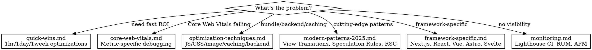

# Web Performance Optimization

Systematic approach to diagnosing and fixing web performance issues across loading, rendering, and runtime.

**Business Impact:** 1 second delay = 7% conversion loss. 0.1s improvement = 8% increase in conversions.

## When to Use

- Lighthouse score below 90 or page speed regression
- Slow LCP (>2.5s), high CLS (>0.1), poor INP (>200ms), high TBT
- Large JavaScript bundles, render-blocking resources
- Layout shifts, jank, slow Time to Interactive (TTI)
- Setting up performance monitoring or budgets
- Implementing View Transitions, Speculation Rules, Server Components, Islands Architecture

## Quick Reference

| Metric | Target | Tool |
|--------|--------|------|
| LCP | < 2.5s | Lighthouse, CrUX |
| CLS | < 0.1 | Lighthouse, Layout Shift Debugger |
| INP | < 200ms | Chrome DevTools Performance |
| TBT | < 200ms | Lighthouse |
| TTFB | < 800ms | WebPageTest, `curl -w` |
| FCP | < 1.8s | Lighthouse |

## Which Reference Do I Need?

## Performance Budget

| Resource | Budget | Rationale |
|----------|--------|-----------|
| Total page weight | < 1.5 MB | 3G loads in ~4s |
| JavaScript (compressed) | < 300 KB | Parsing + execution time |
| CSS (compressed) | < 100 KB | Render blocking |
| Images (above-fold) | < 500 KB | LCP impact |
| Fonts | < 100 KB | FOIT/FOUT prevention |
| Third-party | < 200 KB | Uncontrolled latency |

## Core Web Vitals at a Glance

| Metric | Target | Lighthouse Weight | Key Optimization |
|--------|--------|-------------------|------------------|
| **LCP** (Largest Contentful Paint) | <2.5s | 25% | Optimize images, preload critical resources |
| **INP** (Interaction to Next Paint) | <200ms | 30% | Reduce JavaScript, break up long tasks |
| **CLS** (Cumulative Layout Shift) | <0.1 | 25% | Reserve space, optimize fonts |
| **TBT** (Total Blocking Time) | <200ms | 30% | Code splitting, defer non-critical JS |
| **FCP** (First Contentful Paint) | <1.8s | 10% | Eliminate render-blocking resources |

**-> See [core-web-vitals.md](./references/core-web-vitals.md) for debugging workflows per metric**

## Quick Wins (by time investment)

| Time | Optimization | Impact |
|------|-------------|--------|
| **1hr** | `loading="lazy"` on below-fold images | 40-60% weight reduction |
| | gzip/brotli compression | 70-80% transfer reduction |
| | `rel="preconnect"` for critical origins | 100-500ms savings |
| | `width`/`height` on images | Prevents CLS |
| **1day** | Route-based code splitting | 30-50% bundle reduction |
| | LCP image: `fetchpriority="high"` + WebP/AVIF | 200-400ms LCP improvement |
| | Basic service worker | Instant repeat visits |
| **1wk** | Full HTTP + service worker caching | Reduced server load |
| | Tree shaking + dead code elimination | 40-60% bundle reduction |
| | Lighthouse CI + RUM monitoring | Catch regressions |

**-> See [quick-wins.md](./references/quick-wins.md) for implementation details**

## Runtime Performance Checklist

- Batch DOM reads/writes to avoid layout thrashing
- Debounce scroll/resize handlers (100ms+)
- Use `requestAnimationFrame` for animations (not `setInterval`)
- Virtualize long lists (1000+ items): `content-visibility: auto` or `react-window`/`@tanstack/virtual`
- Avoid synchronous third-party scripts

**-> See [optimization-techniques.md](./references/optimization-techniques.md) for backend, image, JS, CSS, and caching techniques**

## Modern Patterns (2025)

| Pattern | Key Benefit | Complexity |
|---------|------------|------------|
| **View Transitions** | Smooth page transitions, zero JS cost | Low |
| **Speculation Rules** | 0ms navigation via prerendering | Low |
| **Server Components** | Zero-bundle server-only components | Medium |
| **Priority Hints** | `fetchpriority="high"` for LCP | Low |
| **content-visibility** | 7x faster rendering for long pages | Low |
| **Islands Architecture** | 90-99% less JS shipped | High |

**-> See [modern-patterns-2025.md](./references/modern-patterns-2025.md) for implementation details**

## Red Flags

Stop and reconsider if:
- Optimizing without baseline measurement
- Focusing only on Lighthouse score (ignoring field/RUM data)
- Ignoring mobile performance (53% abandon after 3s)
- Loading all resources eagerly (no lazy loading)
- No caching strategy implemented
- Third-party scripts loaded synchronously
- Missing performance monitoring/budgets
- Layout thrashing in scroll/resize handlers
- Long tasks (>50ms) blocking main thread

## Real-World Impact

- Pinterest: 40% faster perceived wait = 15% more sign-ups + 15% more SEO traffic
- Zalando: 0.1s improvement = 0.7% revenue increase
- AutoAnything: 50% faster load = 12-13% sales increase
- Core Web Vitals are Google ranking factors (June 2021+)

## Common Mistakes

| Mistake | Fix |
|---------|-----|
| Optimizing before measuring | Always profile first with Lighthouse/DevTools |
| Lazy-loading above-the-fold images | Only lazy-load below-fold; eager-load LCP image |
| Bundling unused CSS/JS | Use coverage tab in DevTools, then code-split |
| Missing `width`/`height` on images | Causes CLS — always set dimensions or use `aspect-ratio` |
| Blocking render with synchronous JS | Use `defer` or `async` on non-critical scripts |
| Ignoring server response time (TTFB) | Frontend optimization can't fix a slow backend |

## References

- **[Quick Wins](./references/quick-wins.md)** - Time-boxed optimizations with ROI ratings
- **[Core Web Vitals](./references/core-web-vitals.md)** - LCP, INP, CLS debugging workflows
- **[Optimization Techniques](./references/optimization-techniques.md)** - Backend, image, JS, CSS, caching
- **[Modern Patterns 2025](./references/modern-patterns-2025.md)** - View Transitions, Speculation Rules, RSC, Islands
- **[Framework Patterns](./references/framework-specific.md)** - Next.js, React, Vue, Vite, Astro, SvelteKit
- **[Monitoring](./references/monitoring.md)** - Lighthouse CI, RUM, APM, performance budgets
